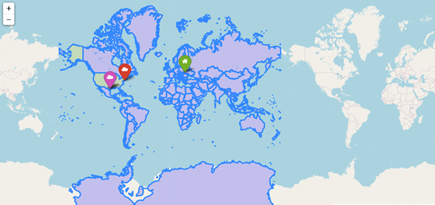

Location

Location is a module which determines up to 10 closest to you places where certain movie was filmed depending on the selected year.

Usage

You need to enter the year in which the movies were filmed, and the coordinates of your location:longitude and latitude.

>>> python main.py
Please enter a year you would like to have a map for: 2014
Please enter your latitude: 49.83826
Please enter your longitude: 24.02324
Map is generating...
Please wait ...
Finished. Please have look at the map index.htm

Result index.html

